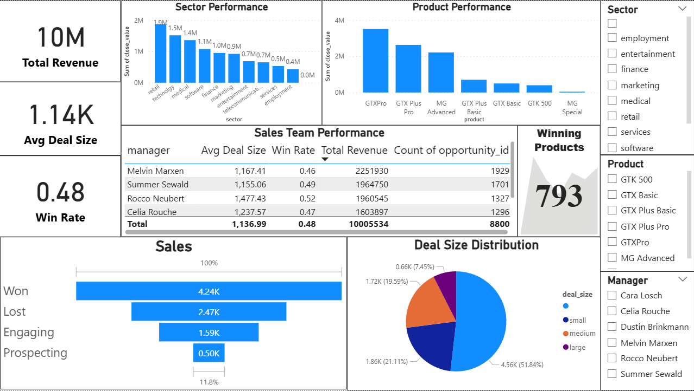

# 📊 Sales Pipeline & Performance Analysis

## 🚀 Overview

This project analyzes sales pipeline data to uncover insights across:

* Pipeline health
* Account performance
* Sales team efficiency
* Product performance
* Data quality issues

The goal is to identify bottlenecks, improve conversion rates, and support data-driven decision-making.

---

## 📂 Dataset

* Source: Internal dataset (cleaned_master_dataset.csv)
* Includes:

  * Deal stages
  * Revenue
  * Account details
  * Sales team information

---

## 🔍 Key Insights

### 1. Pipeline Health

* Identified stages with highest drop-offs
* Conversion rates across pipeline stages

### 2. Account Performance

* Strong vs weak sectors
* Patterns by company size and revenue

### 3. Sales Team Performance

* Win rates by manager/team
* Detection of stalled deals

### 4. Product Performance

* Top converting products
* Revenue contribution by product

### 5. Data Quality

* Missing values
* Inconsistent entries
* Duplicate records

---

## 🛠️ Tech Stack

* Python (Pandas, NumPy, Matplotlib, Seaborn)
* Jupyter Notebook
* Power BI (for dashboard visualization)

---

## 📊 Dashboard

Interactive dashboard built using Power BI:

* Pipeline funnel
* Sales performance metrics
* Product insights


---

## 📸 Preview



---

## ▶️ How to Run

```bash
pip install -r requirements.txt
jupyter notebook
```

---

## 💡 Future Improvements

* Add predictive modeling (win probability)
* Automate reporting pipeline
* Deploy dashboard

---

## 👩‍💻 Author

Shraddha Gurav
